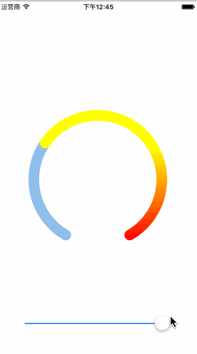

# LoopProgressDemo

环形渐变进度条

## 效果展示

## 类说明

源代码在TCircleView文件夹中，一共分为两个类：`TCircleView`与`TCircleView+BaseConfiguration`。

### `TCircleView `

核心功能实现

### `TCircleView+BaseConfiguration`

相关配置，如

-   三段颜色的配置
-   起始与结束角度配置
-   线宽
-   起始方向配置，顺逆时针
-   ​

## 技术支持

关于实现的逻辑的讲解，参照我的博客：

[http://www.brighttj.com/ios/ios-implement-loop-progress.html](http://www.brighttj.com/ios/ios-implement-loop-progress.html)